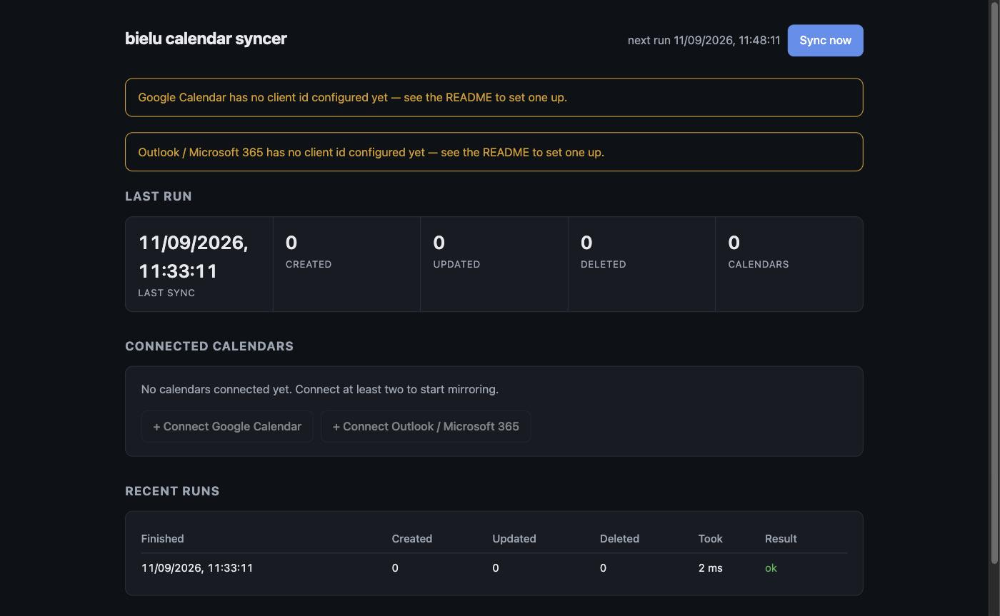

# bielu.calendar.syncer

Keeps any number of Google and Outlook calendars in step by mirroring events between them. Create an event in
one calendar and a copy appears in all the others, following edits and deletions. Runs as a background service
on macOS and ships with a small local dashboard for connecting accounts and watching sync runs.



## What it does

- **Two-way mirroring across every connected calendar.** Not just a pair — connect three Google accounts and
  two Outlook accounts and all five stay consistent.
- **Loop-safe.** Mirrored copies are tagged, so a copy is never copied onward or bounced back to its origin.
- **Preserves privacy and free/busy.** Private events stay private and free/tentative/busy/out-of-office is
  carried across, collapsing only where a backend models fewer states.
- **Runs every 15 minutes** in the background, starting at login.
- **Local dashboard** at `http://localhost:5252` — connect accounts, pause one, disconnect one, sync on demand.

## Requirements

- macOS (the installer registers a LaunchAgent; the app itself is portable)
- [.NET 10 SDK](https://dotnet.microsoft.com/download)

## Setting up OAuth clients

You need one OAuth client per provider. Both are free and neither requires a paid subscription.

> **Do I really need an Azure app registration?** Yes — and so does every other tool that offers a
> "sign in with Outlook" button; they simply ship their own registration instead of showing it to you. Since
> this app runs on your machine under your own identity, the registration has to be yours. It takes a few
> minutes, costs nothing, and needs no Azure subscription.

### Google Calendar

1. Open the [Google Cloud Console](https://console.cloud.google.com/) and create a project.
2. **APIs & Services → Library** → enable **Google Calendar API**.
3. **APIs & Services → OAuth consent screen** → choose **External**, fill in the required fields, and add your
   own Google address under **Test users**. (Staying in "Testing" is fine for personal use — you do not need to
   publish or get the app verified.)
4. **APIs & Services → Credentials → Create credentials → OAuth client ID**:
   - Application type: **Web application**
   - Authorised redirect URI: `http://localhost:5252/api/connect/callback`
5. Copy the **client ID** and **client secret**.

Google requires the secret on the token exchange even for installed apps; it is not treated as a confidential
credential here, but keep it out of source control anyway.

### Outlook / Microsoft 365

1. Open the [Entra ID portal](https://entra.microsoft.com/) → **App registrations → New registration**.
2. Name it anything. For **Supported account types** choose
   *Accounts in any organizational directory and personal Microsoft accounts* so both work and personal
   mailboxes can sign in.
3. Under **Authentication → Add a platform → Mobile and desktop applications**, add the redirect URI
   `http://localhost:5252/api/connect/callback`, and turn **Allow public client flows** on. This makes it a
   public client, which is why no client secret is needed.
4. Copy the **Application (client) ID**.

The `Calendars.ReadWrite` and `User.Read` permissions are requested at sign-in, so you do not need to pre-add
API permissions unless your tenant requires admin consent.

## Configuration

Store the credentials as user secrets so they never touch the repository:

```bash
dotnet user-secrets --project src/Bielu.Calendar.Syncer.Service set "CalendarSyncer:Google:ClientId" "…"
dotnet user-secrets --project src/Bielu.Calendar.Syncer.Service set "CalendarSyncer:Google:ClientSecret" "…"
dotnet user-secrets --project src/Bielu.Calendar.Syncer.Service set "CalendarSyncer:Microsoft:ClientId" "…"
```

For the installed background service, set the same values in
`~/Library/Application Support/bielu/calendar-syncer/appsettings.json`.

Everything else has a working default:

| Setting | Default | Meaning |
|---|---|---|
| `CalendarSyncer:Interval` | `00:15:00` | How often a sync runs |
| `CalendarSyncer:LookBehind` | `7.00:00:00` | How far back events are mirrored |
| `CalendarSyncer:LookAhead` | `60.00:00:00` | How far ahead events are mirrored |
| `CalendarSyncer:MirrorSubjectPrefix` | *(empty)* | Prefix added to mirrored event titles |
| `CalendarSyncer:Microsoft:Tenant` | `common` | Entra directory to sign in against |

## Running

```bash
dotnet run --project src/Bielu.Calendar.Syncer.Service
```

Then open <http://localhost:5252> and use the **Connect** buttons. Connect at least two calendars before
mirroring does anything.

## Installing as a background service

```bash
./scripts/install.sh
```

This publishes a Release build to `~/Library/Application Support/bielu/calendar-syncer`, registers the
LaunchAgent `io.bielu.calendar.syncer`, and starts it. It runs at login from then on.

```bash
tail -f ~/Library/Logs/bielu/calendar-syncer.log   # watch it work
launchctl kickstart -k gui/$(id -u)/io.bielu.calendar.syncer   # restart after a config change
./scripts/uninstall.sh                              # remove the agent and binaries
```

## Where your data lives

| Path | Contents |
|---|---|
| `~/.bielu/calendar-syncer/accounts.json` | Connected accounts and OAuth refresh tokens — written `0600` |
| `~/.bielu/calendar-syncer/links.json` | Map of source events to their mirrored copies |
| `~/Library/Logs/bielu/` | Service logs |

Nothing is sent anywhere except to Google's and Microsoft's own APIs. The dashboard binds to loopback only.

Disconnecting a calendar from the dashboard deletes the mirrored copies it is involved in, in both directions,
so you are not left with orphans.

## Packages

| Package | Purpose |
|---|---|
| `Bielu.Calendar.Syncer` | Core models, mirroring engine, stores, OAuth base, background worker |
| `Bielu.Calendar.Syncer.Google` | Google Calendar provider |
| `Bielu.Calendar.Syncer.Microsoft` | Microsoft Graph (Outlook) provider |
| `Bielu.Calendar.Syncer.Dashboard` | Local dashboard endpoints and UI |

```csharp
builder.Services
    .AddCalendarSyncer(options => options.Interval = TimeSpan.FromMinutes(15))
    .AddGoogleCalendar(options => options.ClientId = "…")
    .AddMicrosoftCalendar(options => options.ClientId = "…");

app.MapCalendarSyncerDashboard();
```

## Contributing

See [AGENT.md](AGENT.md) for architecture and conventions. Every change that touches a shipped package needs a
changeset:

```bash
npx changeset
```

## License

MIT — see [LICENSE](LICENSE).
